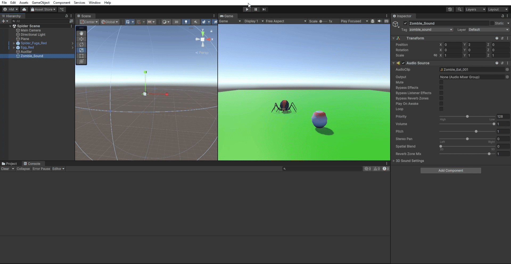
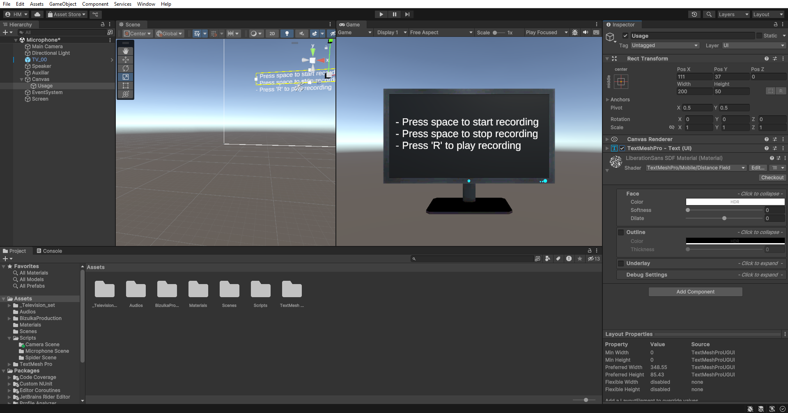
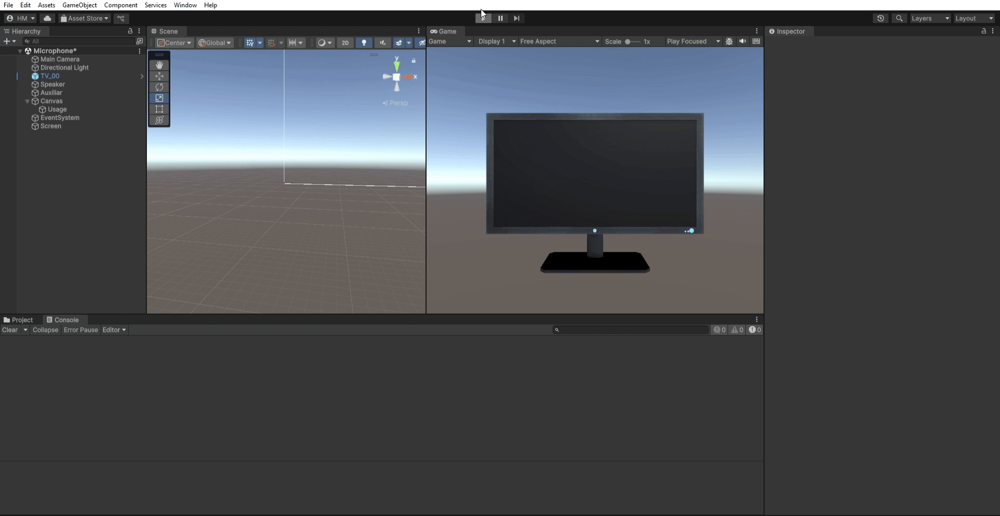

# Interfaces Inteligentes

- Hugo Hernández Martín (alu0101481227@ull.edu.es)

# Práctica 7: Micrófono y cámara

Durante la realización de esta práctica se ha experimentado con el uso del micrófono y la cámara desde Unity.

## Actividad 1: Añadir sonido a un suceso

- Se ha añadido una escena sencilla en la que hay una araña y un huevo de araña.
- Se añade un objeto AudioSource y se configura el sonido deseado (pregrabado).
- Al chocar la araña con el huevo, se reproduce un sonido.

El código desarrollado es el siguiente:
- [Movimiento de la araña.](./Scripts/PlayWithObject.cs)
- [Notificador de las colisiones.](./Scripts/CollisionNotifier.cs)
- [Reproducción del sonido.](./Scripts/PlaySoundOnCollision.cs)

[Video de la escena de la araña con sonido.](./docs/p07_II_spider.mp4)

## Actividad 2: Reproducir una grabación del micrófono

- Se ha creado una escena sencilla con un prefab de una televisión (obtenida en la Asset Store).
- Se añade un objeto AudioSource para permitir la reproducción del sonido.
- Se configura la tecla _espacio_ para comenzar y terminar la grabación del audio del micrófono seleccionado.
- Se configura la tecla _R_ para reproducir la grabación realizada.
- Se añaden unas intrucciones para el usuario en un Canvas.

El código desarrollado es el siguiente:
- [Reproducción de la grabación del micrófono.](./Scripts/PlayMicrophoneRecord.cs)

[Video de la escena de micrófono con sonido.](./docs/p07_II_micro.mp4)

## Actividad 3: Reproducir la salida de una cámara

- Se ha reutilizado la escena de la actividad anterior añadiendo un plano sobre la pantalla de la televisión, que tomará el papel de pantalla.
- Se ha configurado la salida de la cámara como textura del plano.
- Se permite la pausa y reanudación de la reproducción de la salida de la cámara con la tecla _S_.
- Se permite la parada de reproducción con la tecla _P_.
- Se permite la toma de una captura de la imagen de la cámara mediante la tecla _X_.
    - Se ha configurado el almacenamiento de estas capturas en la carpeta _SnapShots_ dentro de _Assets_ del propio proyecto. Además, se configura el nombre mediante la hora y fecha (para evitar la sobreescritura de las capturas en diferentes ejecuciones del código).

El código desarrollado es el siguiente:
- [Reproducción de la captura de la cámara.](./Scripts/PlayCameraRecord.cs)

